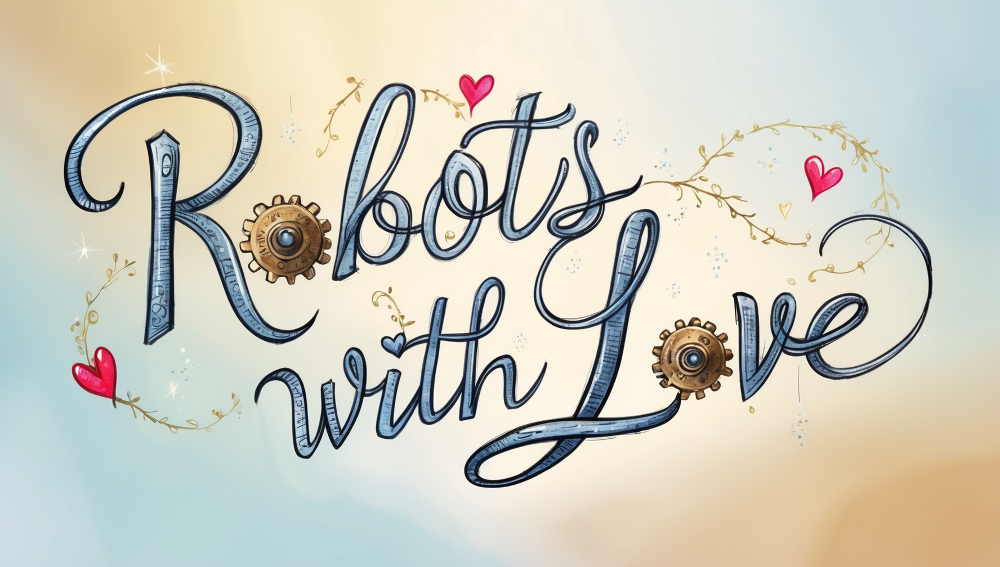

# Welcome

<figure><figcaption></figcaption></figure>

> We believe anyone can build robots, when they are **built with love.**

### Pillars

**RwL is developed with a set of foundational pillars.**

* Tools! - Built the free metaverse entirely with open source, accessible software tooling.
* Easy to Learn! - Built with the hope to have everyone understand the free metaverse.
* Pluralistic! - Participatory in the new distributed economy.

**Get started!**

**You can:**

* Get Started with [Voxel Robots with Love!](voxel-robots/voxel-robots-with-love.md)
* Get more information about fun [Open Source Software](tools/open-source-software.md).
* If you want to learn more about the motivations behind the project read the [Whitepaper, ](https://app.gitbook.com/o/aqyTPLGJA4bLthlhdWLH/s/Ua5ZeGc4YZch5oygAlLM/)or learn how you can [contribute to the RWL community. ](info/contribute-to-rwl.md)
