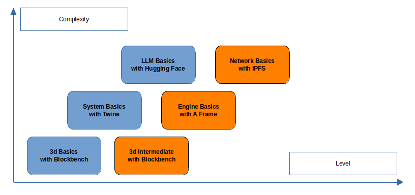

# Network Mission

**Robots with Love** is an autonomous education network designed to teach quality STEM content to kids using open source, and freely accessible software. Learners will learn the basics of 3d, system design, AI, and the basics of open distributed networks.&#x20;

The metaverse should be free for all. Every child deserves to take the first steps to a better future.

## Credentialing Roadmap

<figure><figcaption></figcaption></figure>

The series begins by teaching the basics of 3d, and advancing in complexity to level the user up towards understanding the open source metaverse.
