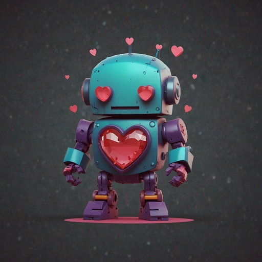

# AI System: Robbie

<figure><figcaption>
Hi Everyone, I'm Robbie!
</figcaption></figure>

Robbie is RwL AI teacher.

She is made up of a variety of AI's working together. Eventually Robbie will run autonomously and locally, but she is currently made up of off the shelf services.

* Otter.ai - Recording of information and organization
* Claude.ai - Scripts and Design
* Eleven Labs - Voice Over - Robbie is a custom voice design.
* Stable Diffusion - Character Design and Assets.

As Robbie is constructed, her code and data sets will be open sourced, and recorded through the blockchain, for ownership of the community.

For more information, read the [Whitepaper.](https://app.gitbook.com/o/aqyTPLGJA4bLthlhdWLH/s/Ua5ZeGc4YZch5oygAlLM/)
