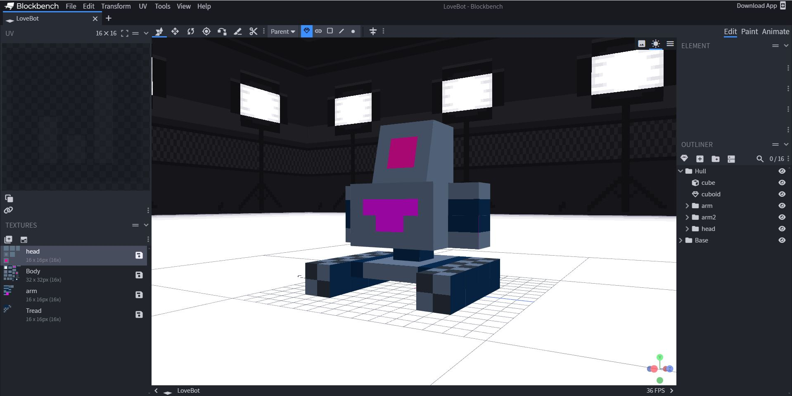

# Voxel Robots with Love

<figure><figcaption>
Building a Voxel Robot with Love
</figcaption></figure>

The following series is about an hour.

It's intended audience is ambitious kids in their early teens who have some computer experience and some grit, but have not been exposed to it. The hope is that the content will also work for others who just wish to learn low poly voxel workflows.&#x20;

#### Getting Going

Open the Blockbench application in a new tab in your browser.



Feel free to download the application to your operating system of choice. The series assumes you will just run it in the browser.
